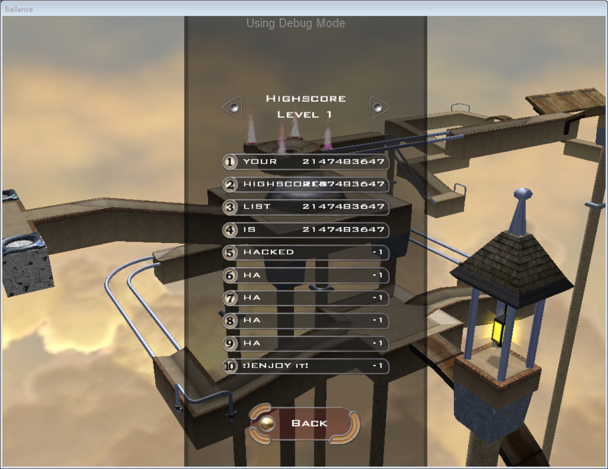

# BallanceRecordChanger

## 项目地址

* [Github Repository](https://github.com/BearKidsTeam/BallanceRecordChanger)

## 贡献过程

这个项目原本是ScoreManager中的一个小部分，在我高考结束的那个暑假中，这个部分被单独抽了出来并加以改进。

原本的代码是jxpxxzj写的，代码用于处理Ballance的记录文件tdb，我也不知道jx用了什么魔幻方法，把数据库解析功能倒腾出来了。但他只写了读取部分，写入部分没有写，一是ScoreManager不需要写入功能，二是防止一些图谋不轨的人利用这个代码去篡改tdb文件。

其实很久之前，我就想过，如果把读取数据库的过程倒过来，不就等同于写入了么，我当时就很想把写如部分完成的，但是自己能力不足+别人劝我别干这种会引起公愤的傻事，我也就没做。

后来就是我高考结束的暑假了，依旧是闲得蛋疼，遂打算开始写，这次，没有人阻拦，我也就顺理成章的pull了相关文件下来开干。

写的时候，边写边用HxD看数据，tdb文件其实就是一个把一个数据文件混淆了下，用jx的代码做了混淆，反混淆。然后把一些在读取时候被丢弃的数据补充回去（这部分的难度我在很久之前就想过），最后总算写好了。

但是每当我加载tdb的时候，游戏就会黑屏，很无奈，只能一直查哪里错了。最后查到是一个丢弃的数值，标示的是后面数据块的长度，而我直接把它写成了个定值，故黑屏，改了之后就很顺畅地进了游戏，然后也看到了黑排行榜的结果。虽然现在寥寥数字就把问题说明白了，但是当时，我确实查了一整个下午，或许是我脑壳愚笨吧。

写好之后，整个程序的基本操作就是把tdb dump成一个json让你乱改，然后再帮你还原回去。

我一开始以Private repo的形式发在了oschina上，但是因为我辣鸡，一个Pri repo还放Public License。此外我还把成果发到QQ群里和Discord里，众说纷纭，最后一些人和我说：都8102年了，也没必要隐藏什么了，遂我在Github上开源了这个项目，并附带了一个Release包。

## 截图

