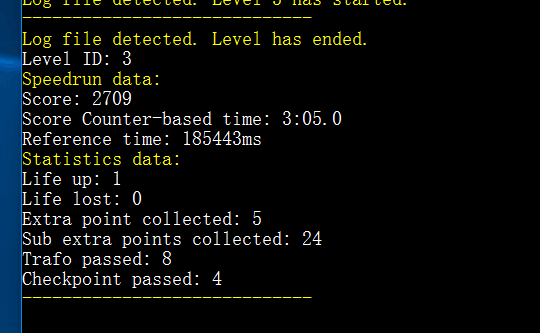

# ScoreManager-Core

## 项目地址

* [Github repository](https://github.com/BearKidsTeam/ScoreManager-Core)

## 贡献过程

与[BallanceRecordChanger](./BallanceRecordChanger.md)相似的是，ScoreManager-Core也是ScoreManager中的某个核心部分被抽出来使用了。这个核心部分是记录检测功能。该部分先于BallanceRecordChanger被单独独立出来。

该功能的主要部分分为两块，一个是NMO注入游戏，这部分如果我没记错的话，是2jjy写的，用几个NMO注入游戏然后把游戏结束时的数据导出到一个文本文件中。然后就是jxpxxzj写的部分，C#部分，负责读取文本文件得到数据。

依稀记得这个Repo的起源。我大概在2018一月份（就是我高考之前的那个寒假），[以所有者的身份建立了Ballance Discord服务器](../work/discord.md)，然后邀请了一些活跃在speedrun.com的外国玩家进入服务器。在那是，我还*天真地*认为国内国外的Ballance记录可以合并，为了向外国人展示~~他们的记录计时方式是多么落后~~以及国内已存的优秀计时方法，于是BKT决定将ScoreManager的纪录检测核心独立出来。（因为那时候服务器大部分都是BKT成员，然后ScoreManager还是BKT内某些成员一手写出来的私有项目，很好操作）

我记得当时是jxpxxzj委派我做（也可能我记错了），我从原本就是jxpxxzj的代码里摘抄了一段出来，然后东拼西凑把Demo做好了。然后jxpxxzj觉得有点问题，让我改改，反复几次后。jxpxxzj觉得还是不满意，然后让我直接把项目打包给他，他改好就传上去。大概一天之后吧，纠正了一些输出文本的语法错误（文法上的，不是编程上的语法错误），还原了我变态的格式（我喜欢大括号不换行），然后就上传了。

我个人心里有点小不爽，花了一下午的时间*摘抄*出来的东西，让他人commit，是个人都会觉得有点怪怪的感觉。但是毕竟代码都是jxpxxzj的，**我也只做个整合的工作，毫无荣誉与功劳可言，**所以，让原作者上传也便成了正统之举，我也多说啥。抱怨总是会引来一些不好的后果，似乎是这个道理吧...

但是不爽确实是真实存在的，挥之不去的，这也就是为什么我把这个东西写到我的贡献里了，尽管这个Repo没有我一个commit。

## 小插曲

这是一个命令行程序，单线程。我为了它能持续运行，不要执行一次就跳出了，我写了以下语句用以保证直到按下Z退出：

```c#
while (true)
{
    var result = Console.ReadKey(true);
    if (result.Key == ConsoleKey.Z) break;
}
```

然后jxpxxzj拿到这段代码之后，表示很奇怪，说这个是干啥的。我说是为了无限循环，按下Z退出的。然后过了一段时间后，jxpxxzj扔出个我不明觉厉的StackOverflow网页，大概意思就是这么写会影响性能。于是jxpxxzj就把代码整成下面这个样子了：

```c#
while (true)
{
    var result = Console.ReadKey(true);
    if (result.Key == ConsoleKey.Z) {
        break;
    } else {
        Thread.Sleep(500);
    }
}
```

我并不知道为什么。我写的那个语句已经用在了我几乎所有需要无限循环，抑制退出的命令行程序里面。但目前为止，我还没发现什么性能问题。如果您知道为什么的话，烦请告知我。

## 截图


