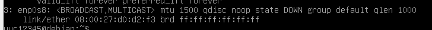

# 记LibCmo Linux环境配置

## 更改VBox虚拟硬盘的位置

虚拟机是很早之前安装的，虚拟硬盘创建在实体机的HDD上，由于实体机的HDD已经服役5年多了，担心随时会坏掉，就打算把虚拟机对应的虚拟硬盘迁移到新装没多久的SSD上。一来数据不会随着哪天HDD突然暴毙一起没了，也能加速使用速度。

参考[这篇文章](https://zhuanlan.zhihu.com/p/339788215)，具体方法是先把虚拟硬盘文件从HDD复制到SSD里，我这里是只有一个`vid`文件，因为我不用其它诸如快照之类的功能。然后导航到VBox安装目录下，打开命令行，执行`.\VBoxManage.exe internalcommands sethduuid "J:\VBoxImage\debian_console.vdi"`，主要目的是给`vid`文件重新生成一个UUID。我不懂为啥，但是如果不生成，那么替换硬盘文件的时候，或替换硬盘文件之后，会发生没法加载硬盘文件的问题。

然后剩下的就非常简单了，打开虚拟机属性，存储选项卡，选中你复制过去的原来的那个硬盘，然后在右边虚拟硬盘处选择你复制过去的新虚拟硬盘文件就好了。

## 固定VBox虚拟机IP地址

我需要用VSCode本地连接到我的虚拟机里进行开发，而如果采用通常的方案，虚拟机的IP地址会变动，而又因为VSCode对于这种变动的IP地址的远程开发非常不爽，所以我需要固定虚拟机的IP地址，同时虚拟机还可以正常访问网络，不然一个脱机的虚拟机也没法正常开发。这部分是最麻烦的，网络上找到的要么全是国内特色的CentOS的教程，要么是过时的Ubuntu教程，就没一个好好讲怎么在现今Debian里配置环境的。我把我踩过的坑都说一遍。

我采用的方案大体是[这篇文章](https://zhuanlan.zhihu.com/p/341328334)提供的，即通过双网卡，来实现虚拟机固定的本地IP，以及可以访问网络的功能。

首先第一步就有问题，我的虚拟机没法按NAT网络连接上外部网络，也就是使用NAT模式后我没法访问互联网。我不知道为什么。因为我虚拟机一直是用桥接模式上网的，换成NAT后怎么也连不上，考虑到这个网卡只是用来访问互联网的，用NAT和桥接网卡也没差，就继续保持桥接了。因此文章第一步NAT网络的设置也不需要做了。

然后按照文章，在`VirtualBox->管理->主机网络管理器`中设置一个Host-Only网卡。我之前设置过一个，所以这里就免去创建了，我就直接把它IPv4地址记下来了先。

第三步，设置虚拟机网卡，文章里网卡1是NAT，网卡2是Host-Only。我这里网卡1就是桥接，网卡2是Host-Only。一开始我觉得两者颠倒也没啥，于是网卡1配置的是Host-Only，网卡2配置的是桥接。哪知进虚拟机后只有Host-Only管用，导致无法访问互联网，我连apt都用不了。虽然后来发现是忘了在虚拟机里开网卡，但是我最后还是换回了以开始的顺序，即1是桥接，2是Host-Only。至少这样我一开始虚拟机还有网能用，不会什么都做不了。

做完后就可以启动虚拟机了。从这开始才是痛苦的开始，首先，CentOS和Debian的网络架构不同，我没有什么`service network status`指令，更没有`/etc/sysconfig/network-scripts/ifcfg-enp0s3`这种文件路径。我只能去查和问群友怎么操作。我遇到的第一个问题就是似乎只有一个网卡管用。用`ip addr`打印出来是这样的。



查到可能是没开网卡，于是找资料查怎么开网卡。然后就是发现我根本没有ipconfig，ifup，ipdown这种指令。我根本不知道该用什么东西来开网卡。根据我以往玩Linux的经验，虽然我不知道什么能开网卡，但是无脑去搜哪个包有这几个指令然后装的方法是最不可取的，很可能会装坏然后越陷越深。万幸，万能的群友告诉我，可以用`sudo ip link set dev enp0s8 up`开网卡。并向我指出ifconfig是不再建议使用的了。真是过时教程害死人。

知道要用ip指令了，那我就得查查它参数是干啥的。于是找到了篇[菜鸟教程](https://www.runoob.com/linux/linux-comm-ip.html)，查了下大概怎么用，确认没问题就执行了，顺便这个页面里还有其它常用ip指令，也顺便阅读了一下。然后用`ip addr`打印一下，确实启动了，但没有完全启动，地址里只有IPv6地址。我只能用找到的指令`sudo ip addr add 192.168.56.101/24 dev enp0s8`尝试性给他一个IPv4地址。用`ip addr`打印一下有地址了，然后从物理机去`ping 192.168.56.101`，是有回应的，确认没问题了。

接下来就是把它变成静态地址，并开机自动设置，我可不想每次开机都得输一坨指令折腾好Host-Only网卡再用。查阅到[这篇文章](https://blog.csdn.net/u011077672/article/details/71123319)和[Debian官方文档](https://wiki.debian.org/NetworkConfiguration)，了解到如何设置。用vim编辑`/etc/network/interfaces`，添加了如下代码

```
auto enp0s8
iface enp0s8 inet static
    address 192.168.56.101
    netmask 255.255.255.0
```

这些配置将把Host-Only网卡配置为静态地址，并指定IP为`192.168.56.101`。重启后发现网卡运作正常，问题终于解决。

## 更换编译器为Clang

虚拟机安装的时候无脑先装了GCC。然而根据以往试用的经验和结论而言，GCC和MSVC的编译错误提示远远比不上Clang的。

首先安装Clang。我这里用的是Debian Bullseye，官方库里有Clang 9, 11, 13。其中Clang包默认装11。由于我的项目要用C++ 20语言标准，那Clang当然是越新越好。所以我没有直接`sudp apt install clang`，而是转而`sudo apt install clang-13`。装完之后，发现执行`clang`没有反应，必须要执行`clang-13`才可以。

装完确认能用之后，就要把它设置为默认编译器了。由于之前装的GCC，默认是GCC，所以需要做一些操作把默认编译器从GCC改为Clang。[查阅](https://askubuntu.com/questions/1198087/how-to-set-clang-9-as-the-default-c-compiler-on-ubuntu-19-10)到可以用`sudo update-alternatives --config c++`搞出一个可交互页面，输入数字即可更改默认值。然后直接执行，发现给我提示说没有可选项，只有GCC一个。感觉是什么东西没配置，觉得可能是没装Clang主包导致的，遂准备执行`sudo apt install clang`，但是在apt的输出里一看，它居然不认Clang 13，偏要给我再装Clang 11。只能另寻他法。

[发现](https://askubuntu.com/questions/584711/clang-and-clang-not-found-after-installing-the-clang-3-5-package)需要执行一个安装指令`ssudo update-alternatives --install /usr/bin/c++ c++ /usr/bin/clang++-13 100`才可以选择。同时也看到另一个安装指令`sudo update-alternatives --install /usr/bin/cc cc /usr/bin/clang-13 100`，这是安装C编译器的，第一条是安装C++编译器的。于是通过`whereis clang-13`确定`clang-13`是在`/usr/bin/clang++-13`这个位置后，执行了这两个安装指令。其中`100`是一个编译器优先级，数字越大，在默认模式中越会使用这个编译器。

然后重新执行`sudo update-alternatives --config c++`，果然弹出选择界面。有0，1，2可以选择。其中0是自动模式，根据给定的编译器优先级自动分配编译器，我这里由于给Clang分配了100，GCC默认只有20，所以自动模式已经是默认使用Clang了，但是为了稳妥起见，我还是选择1，强制使用Clang。顺便又执行了`sudo update-alternatives --config cc`把默认C编译器也换成Clang了。


