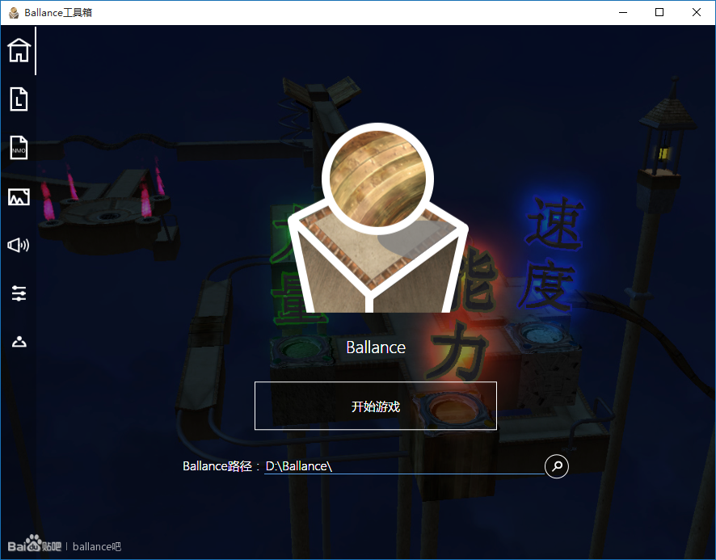

# ballance_tools

## 工程地址

* [Github Repository](https://github.com/yyc12345/ballance_tools)

## 开发过程

开发过程记得主要是是升入高中时做的。当时中考结束，异常无聊，尤其是当时[bus_rode](./bus_rode.md)的编写遇到了阻力，使我开始思考我~~TM~~还能写些什么。由于我是小学毕业加入的Ballance吧，已经混了3年了，也掌握了一些Ballance内各类常用补丁的安装方法，且当时的工具箱在我看来惨不忍睹，于是决定重置一份工具箱。

我不记得重置具体的过程了，只知道当时一股脑把自己知道的东西全塞进去了。有一些原来工具箱没有的功能我也添加进去了。当时正值吧内工具箱制作热潮之中，我本以为我的辣鸡玩意不会被人们所看上。但是站在3年后的今天回望，我的工具箱还是有存在感的，虽然没有[Ballamap](https://github.com/BillChen2000/Ballamap)那么显赫被加入到旧工具箱的打包之中，也不像[ScoreManager](https://tieba.baidu.com/p/3512583003)那样受人关注，但是能有一席之地我就满足了。

开发过程中我曾考虑将其接驳到ScoreManager上以提供排行榜查询。期间发生了一些小插曲，当时ScoreManager还是属于私有工程范畴（现在也是，只不过一些核心功能以独立的方式开源了），我还不是很熟悉使用git和Github，于是我沙雕一般的把jx给我的ScoreManager核心文件直接传上去了，然后我做了补救，用gitignore和`git rm --cached xxx.cs`把它去除跟踪了，但是依然被说：查git记录就能爬到核心文件，所以我只能删了Github repository然后再次上传。这插曲也算是长了个教训吧。

更新完第三版之后，我原本是有动力更新的，我尝试做了新的对话框界面，Material Design风格的，但是无人问津，我也没再继续碰这个工程了，高中学业繁忙，我只能把有限的时间投入到更多的新工程里。于是这个项目就凉了。

我当时还设想过做联机部分，并用C#重构整个工具箱，相关工程在[这里](https://github.com/yyc12345/BallanceToolsBox)，但是最后写完联机部分并测试时，测试总是出错，我也就放在那里没去管它了。因此这个项目也只有联机部分不能运行的代码，其余部分连重写都没有重写。

3年后，我高考结束了。我终于有大把的时间回望我曾经废弃的工程，我决定对这个工程做个了结。高中3年发生了太多事情了：ScoreManager停运，导致整个排行榜部分不能使用；我关闭了我的百度网盘，以至人们要使用只能自己编译工程，而且工程还不好编译。于是我`git clone`了这个工程，回顾了一下代码，把无关代码移除，修复3年内断断续续报上来的bug，然后替换了一套新图标，编译了一份可用包，打了个tag并把包上传到Github上了。随后，我写了份比较随意的README.md并提交，然后把工程标记为Archived，至此结束ballance_tools的开发。

站在现在的时空，回顾ballance_tools，只有一点是确认的：它太过超前，且我的编程技术不足以达到那种高度。

## 截图

由于资源丢失，只能找到最初版本的截图了：

