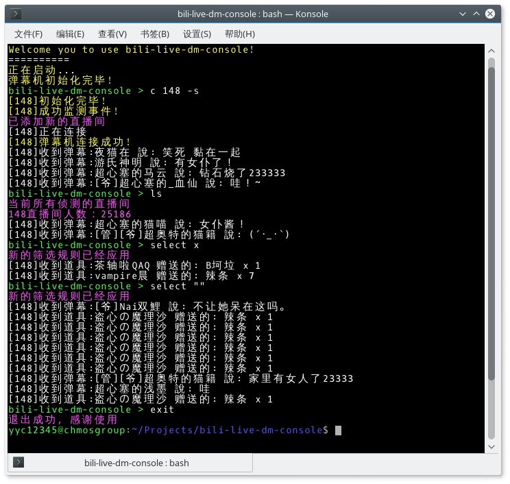

# bili-live-dm-console

一个Bilibili直播弹幕实时接收器，命令行版本。在我写这个程序的时候，已经有图形界面的，可以跑在全平台的Bilibili直播弹幕接收器了（好像是用Vue.js写的？）

## 工程地址

[Github repository](https://github.com/yyc12345/bili-live-dm-console)

## 开发过程

这是我**第一个，唯一一个，以及最后一个完全在Linux下开发的C#程序**。记得当时是在实体机上刚折腾好KDE x Debian 8。然后就开始用VS Code折腾C#开发（后来发现开发感觉和吃翔一样）。

大部分代码来自[copyliu的初代弹幕姬](https://github.com/copyliu/bililive_dm)，我把核心部分摘取出来之后，做了一些小改动，实现了基本的监听功能，然后用了用。

然后就发现，URL ID != Room ID这个事实，具体是我一直用浏览器上面的数字当ID，但是当我输入数字较小的号码时，很大概率会报错，翻了许久，在[copyliu的Repo里的一个wontfix的issue里](https://github.com/copyliu/bililive_dm/issues/7)查到了原因，也就是前面说的：URL ID != Room ID。然后我就开始查详细，发现直接GET对应直播间的HTML，可以解析出真实的Room ID。于是，加了个参数，把这个功能加上了。

后来~~觉得不爽，想装逼~~，就加了可以添加多个直播间监视的功能，然后加了一坨指令，重构了核心。提交了。事实上，这些功能完全没用。因为没有人会闲得无聊同时看2个及以上直播间的弹幕的。。。

之后因为KDE黑屏事件，解决无果，我删了Linux，这个项目就再也没动过。

我一直在关注copyliu的弹幕机更新，以防止接口更换，但到目前为止，似乎并没有什么接口方面的问题需要我去操心。我现在更担心的是当初我写得从HTML里查找Room ID的代码是否仍然可用，因为Bilibili网页部分的更新我无法关注，且我可能在我代码里写死了路径，更改了，就有可能搜不到。

但就目前来说，我还不想管这个Repo，先就让它在那里安心地躺着吧。

## 截图

