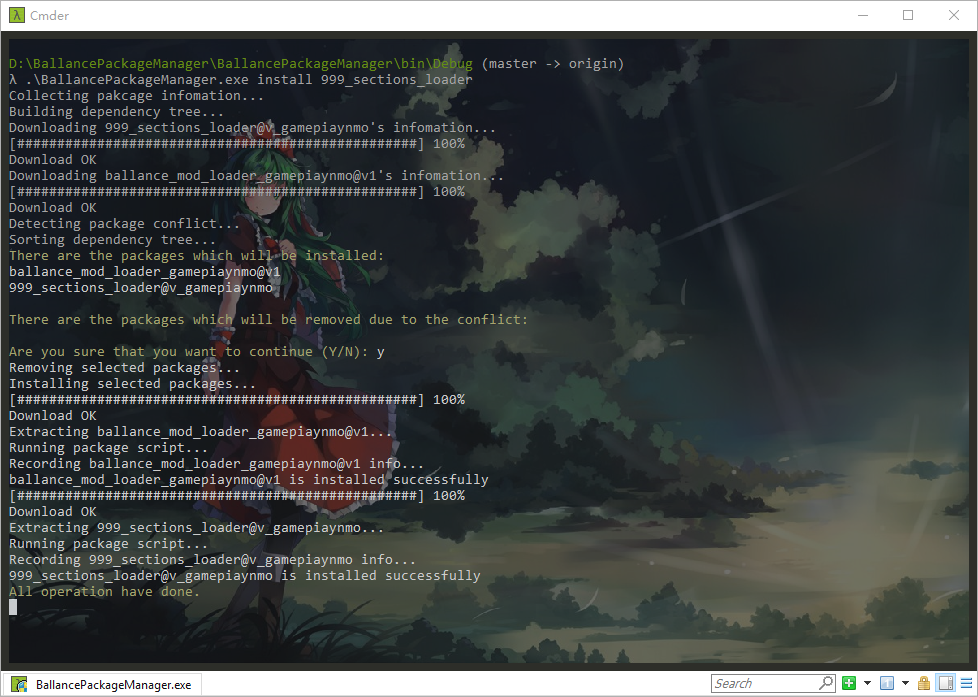

# bpm

## 工程地址

* [Github repository](https://github.com/yyc12345/bpm)

## 开发过程

十一假期期间，我一直对Ballance工具箱的简陋与落后耿耿于怀，而且Ballance的资源过于分散，于是我想做一个能统领各Ballance资源的东西。

原本打算用WPF做图形界面的程序的，后来我认识到我自己的情况：我做图形界面只会把重心放在界面上而忽略了核心的建设。于是我毅然删了工程，改作命令行版本。当时我在学习Linux，对包管理器十分青睐，于是我打算将包管理器的概念带到Ballance，也就是用包组织各类Ballance资源并给予统一管理。

开发过程不算顺利，也不算困难。有Chris椰叶的帮助，我认识到包依赖的解决可以用拓扑排序来做，而包冲突的解决，椰叶一直没告诉我，我也没查到，于是就自己XJB实现了一个，目前来说没出过问题。

我选用了Python作为包内部的脚本执行语言，主要是考虑到以后的跨平台实现。但是由于我用的是IronPython，我并不清楚它能否正确执行以及能稳定迁移，所以我现在开始考虑LiveSplit中使用的ASL的实现，即动态编译C\#文件来作为执行脚本。

目前，bpm的大部分内容都已经写好。只有用户手册/插件开发手册没写。以及我还没有真正部署bpm，我还需要解决上面所说的跨平台问题，以及验证它的可行性。之后，我才能部署bpm，整个工作我想会在新年到来之前搞定。

bpm总的来说，开发时间比较短，代码比较少，界面简陋，但我相信它能够做到更多。后期如果时间允许，我会为它制作一个图形界面的，我考虑使用.Net Core的非官方跨平台界面：[Avalonia](https://github.com/AvaloniaUI/Avalonia)

## 截图

