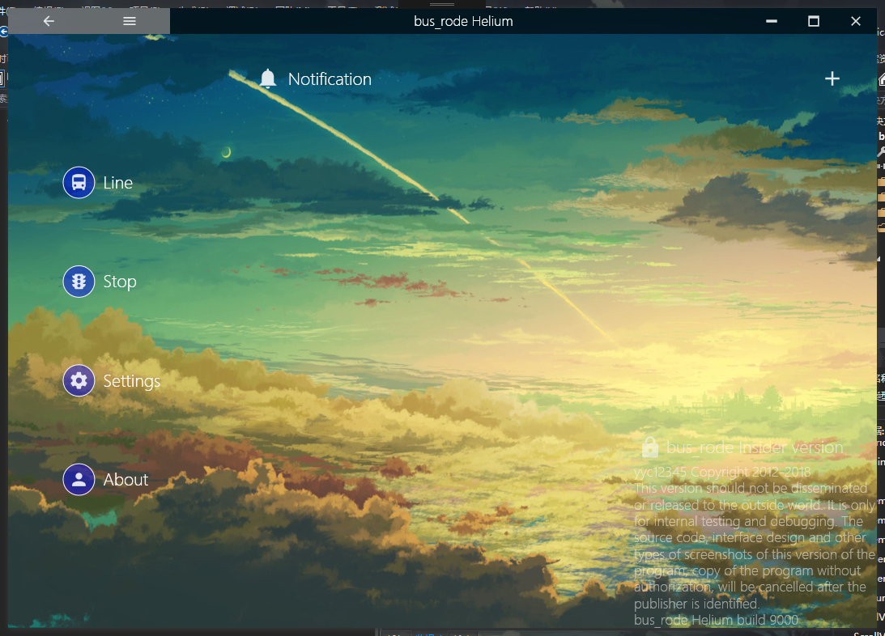

# bus_rode

一个可以查看公交线路的应用程序

由于截图均被发在QQ空间，但我已经将QQ空间所有照片删除，因此大部分截图记录均消失了。

## 分类

* bus_rode分为几个开发阶段。最初版本是用Windows控件拼凑起来的玩意。没有任何实质代码
* 第二版本是Visual Basic .Net与GDI+写的。最初十分简陋。后来逐渐有了雏形。
* 第三版本是用Visual Basic .Net和WPF写的。
* 第四版本使用C\#和WPF进行构建。

## 第一版本

就是各种控件堆砌的程序，没有实际代码。开发是在一台破旧的电脑，但是被我强行安装了Windows 7的电脑上进行的。在拥有更好的电脑之前，几乎所有开发都是在那台电脑上进行的。

## 第二版本

那时候，由于某些不可说的原因。我下定决心写出这个工程。我当时凑巧拿到了一份GDI+的PowerPoint文稿，便尝试使用GDI+绘制整个程序。效果挺好的，于是我决定按这条路走下去。

我相继写了一些有用的模块，并发布了第一个版本。在被羊羊羊看到之后，他友好地表示能不能为我的程序设计一个新界面，因为旧的界面太丑了。我很高兴，随后按照他的设计重构了整个程序的界面，效果立竿见影。很棒。

后来，我发现GDI+绘制的时候，很容易撕裂窗口而且效率不高，CPU占用还很大，于是我了解到了双缓存，但是尝试几次后还是原样。于是我只得使用一个内置双缓存的ImageBox，然后在内存中绘制图像并呈现，撕裂问题解决了，但是新出现的内存占用过大的问题一直无法解决。

## 第三版本

* [Github repository](https://github.com/yyc12345/bus_rode_windows_old)

记得我买了本书，好像是C#的书，里面介绍了WPF，我觉得这东西非常棒，于是打算采用WPF重构。

期间花了不少时间，也了解了许多WPF有关的技术（虽然都是表面的东西），也算是为我之后的WPF开了个头，练习了一下吧。

最后做了出来，并对原有UI界面做了一些改进。由于核心部分并没有多大改动，因此也没有花费太多精力，主要是集中于界面的改进。

当然，核心的修改是有的，比如完整支持了实时公交插件，使用反射特性进行加载并获取，并成功测试了我所在城市的公交实时系统。

## 第四版本

* [Github repository](https://github.com/yyc12345/bus_rode)

一直说要做，可是一直没做的项目。

实话实说，只写了界面，内核的重构根本没有进行。而且目前我也没有任何更新的想法，就让它在那静静的躺着吧。。。

### 截图

